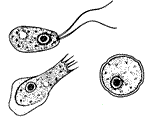

# Naegleria

A brainfuck compiler written in PHP.

> Naegleria fowleri /nəˈɡlɪəriə/ (also known as the "brain-eating amoeba") infects people by entering the body through the nose.

## Usage

You can use Naegleria to compile a brainfuck file into AT&T assembly. This can then be assembled using `gcc`, and executed directly.

    $ bin/compile examples/hello.b > hello.s
    $ gcc -o hello hello.s
    $ ./hello
    Hello World!

## Platforms

Targets 64-bit x86 on linux, specifically gcc.

## Benchmarks

Run your own.

## Optimizations

This is not (yet) an optimizing compiler.

## Acknowledgements

* Thanks to [@codeoracle](https://twitter.com/codeoracle) for the inspiration to pick up `gcc -S`.
* Thanks to [@old_sound](https://twitter.com/old_sound) for coming up with the name and logo.
